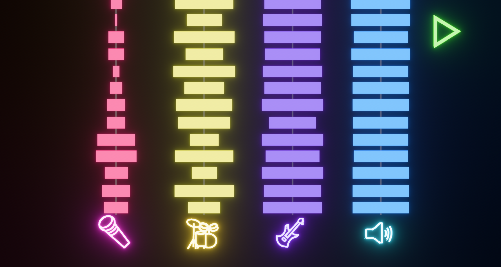
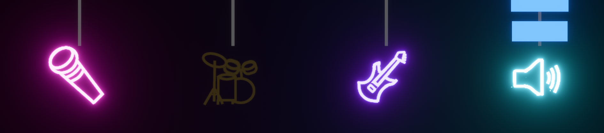
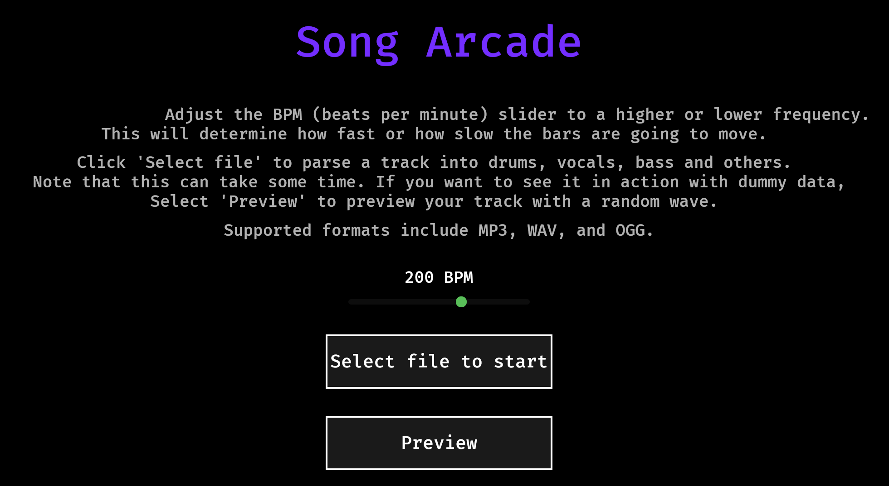

-------------------
# SoundArcade
-------------------
I have been looking for a way to play music in a more immersive way, especially for music educators.
Basing the visuals on a "Rock Band" aesthetic, I thought that allowing people to control which instruments they want
to hear at a given time would help with explaining the music.

Use the app however you want, as long as you don't use this code in another commercial application (GPL-3.0).

You can see it in action [here](https://www.youtube.com/@PenguinAstronautMusic)

Note that this app is in early development. Any help is appreciated!

### Support the devs!
If you like this product, consider [buying me a coffee](https://buymeacoffee.com/penguinasto)
Thanks <3

## How this works

You select a sound file that you want to play, and the app will parse it into drums, vocals, bass, and other 
instruments. Use the play/stop buttons to control the playback.

The different instrument icons can be used to mute the playback of a specific instrument.
For example, if you only want to hear the vocals, you can click on the drums, bass, and other instruments to stop them.

This app takes some time to parse the tracks, but fortunately, once it's done, the next time you load the same song,
it will be much faster.

There also is a preview setting that will show you a random waveform for your track, so you can see what it looks like
without waiting for the parsing to finish.

Adjusting the "BMP" will change how many bars are going to be spawned in the visualizer per second.

## The Nerdy Stuff
This app is built using [Bevy](https://bevyengine.org/) for the visualization.
The audio processing is done using [stem-splitter-core](https://github.com/gentij/stem-splitter-core), to parse the 
audio into stems.

I personally use [RustRover](https://www.jetbrains.com/rust/) to build this app.
`cargo run` will start the app.

The design overall is pretty simple; audio_processing contains the different audio processing modules, used mostly
within the backend.rs file. 

Each UI component is stored in their own file and is linked to the backend using the midware.rs file. The goal
here is to keep the UI components separate from the backend, to allow for replacing the different components if needed.

Feel free to suggest any improvements or features!